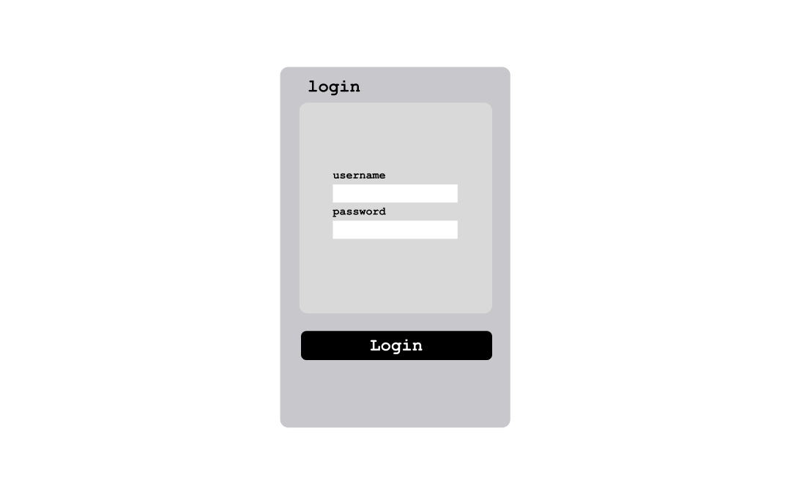
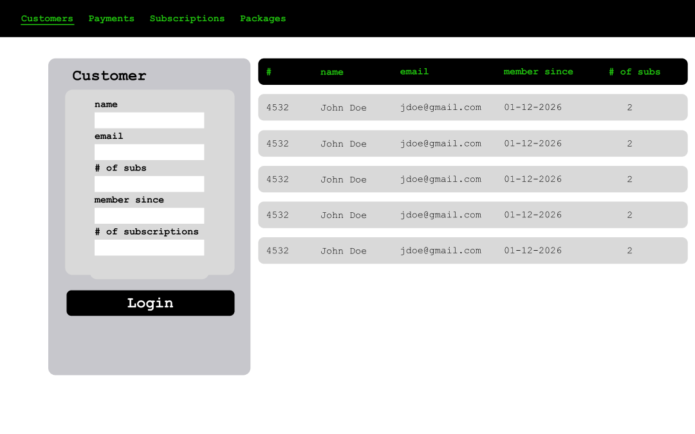
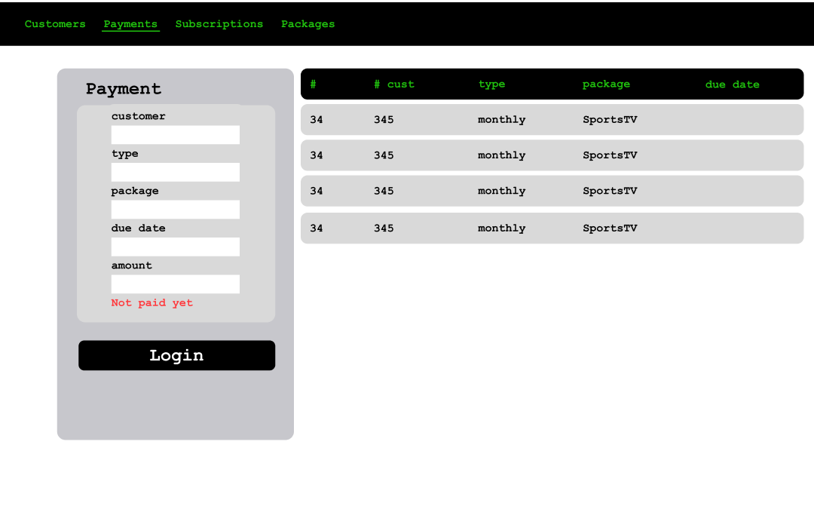
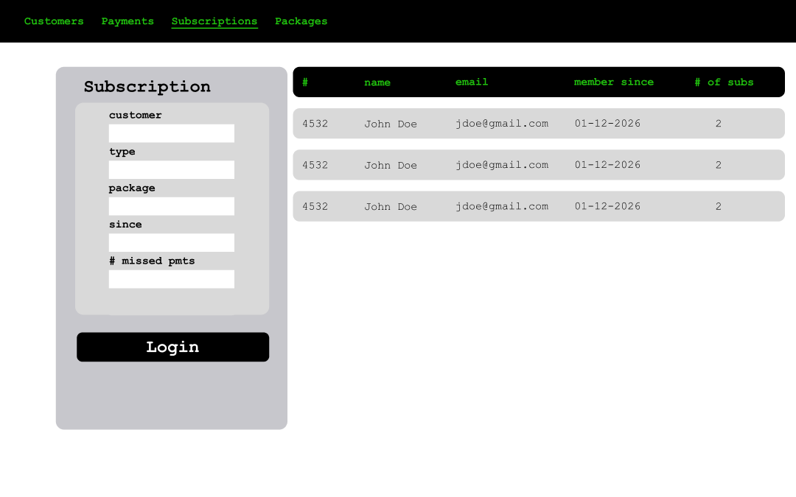

# Subscription & Billing Tracker

<!-- Badges -->


---

## LOCAL SETUP

- This repo is a minimal starter for a billing app using **React + Express + Prisma + PostgreSQL** (all containerized with Docker).  
- The Prisma schema already defines the core entities: **Customer**, **Package**, **Subscription**, and **Payment**.
- Currently the instructions below will enable verifying the local setup through Docker Desktop

- Available pages will be: http://localhost:5173/customers, http://localhost:5173/packages, http://localhost:5173/payments, http://localhost:5173/subscriptions
- The pages listed above are for now placeholders (to become CRUD for each of those entities)
- Also, one api call is exposed at localhost:3001/api/health which signals the availability of the system

## 1) Clone the Repository

- Open **PowerShell** (recommended) or **Command Prompt**, then run:
```bash
git clone <YOUR_REPO_URL> billing-app
cd billing-app
```

## 2) Prerequisites / checks

- Install Docker Desktop and make sure it is running.
- Install Git (so git clone works).

Make sure these ports are not in use on your machine:
- 5173 (React UI)
- 3001 (Express API)
- 5432 (PostgreSQL)
- Local PostgreSQL cannot be running on port 5432 (if it is kill the process)

## 3) Environment files

- This repo contains two .env files (server/.env and client/.env)
- since they do not contain any secret information they have been committed to GitHub
- If the .env file contains sensitive information such as passwords, API keys, or secret tokens, it should not be included in the GitHub repository.

## 4) Building and Starting the stack

- Once cloned onto your device go to the repo root and run this command (use cmd or PowerShell):

```bash
docker compose up --build -d
```

(This command will start Postgres (localhost:5432), Express API (localhost:3001), React app (localhost:5173))

---

## DESCRIPTION

**Subscription & Billing Tracker** is a full-stack web application that helps manage recurring services and their billing lifecycle. It centralizes the data model around **Customers**, **Packages/Services**, **Subscriptions**, and **Payments**, making it easy to track who is subscribed to what, what billing plan they are on (**monthly / annual**), and whether each expected payment has been completed (**paid / unpaid**).

The system is built with a clear separation between a **Node.js + Express REST API** and a **React (Vite) frontend**, backed by a **PostgreSQL** database using **Prisma** for migrations and typed database access. The goal is to provide a realistic production-style project structure with clean CRUD endpoints, validation, and predictable local setup through **Docker Compose**.

On top of basic record management, the app includes an **analytics layer** that performs statistical calculations from the stored data to generate useful insights such as revenue summaries, subscription counts, payment performance, overdue/unpaid totals, and trend-style metrics over time. These stats are designed to support dashboards and reporting features as the project grows.

This project is containerized with **Docker Compose** to ensure consistent setup and easy local development.

---

## TECH STACK (subject to evolution)

### Backend
- Node.js
- Express
- Prisma (ORM)
- PostgreSQL

### Frontend
- React (Vite)

### DevOps & Quality
- Docker Compose
- GitHub Actions (CI)
- Jest + Supertest (API testing)
- Logging + metrics (via structured logs)

---

## PROJECT DIRECTION

- CRUD foundation will be established for each entity (Customer, Packages, Subscriptions, Payments)
- Project will then expand in several directions to resemble an analytical platform, and not just records keeping software. 
- The exact feature set may evolve, but the direction is clear and development is structured around these goals:

### 1) Analytics & reporting
- Summary endpoints and dashboard views (revenue totals, subscription activity, payment status breakdowns)
- Time-based summaries and trend charts (weekly/monthly views)
- Filtering by customer, package, and date range

### 2) Forecasting / predictions
- Forecasting expected upcoming billing totals based on active subscriptions and billing cycles
- Statistical trend modeling based on historical payments and subscription activity
- Risk indicators such as likely late payments and churn signals based on patterns in the stored data

### 3) Automation
- Payment generation utilities to create upcoming due payments for active subscriptions
- Scheduled jobs to maintain up-to-date payment schedules and refresh analytics snapshots

---

## UI mockup pages (for login and CRUD operations - made with Figma)

### Login

### Customer

### Payment

### Subscription

### Package


---

## DOCUMENTATION
- [Home](docs/Home.md)
- [Architecture Overview](docs/Architecture-Overview.md)
- [Data Model](docs/Data-Model.md)
- [Planned Features & System Evolution](docs/Planned-Features.md)

